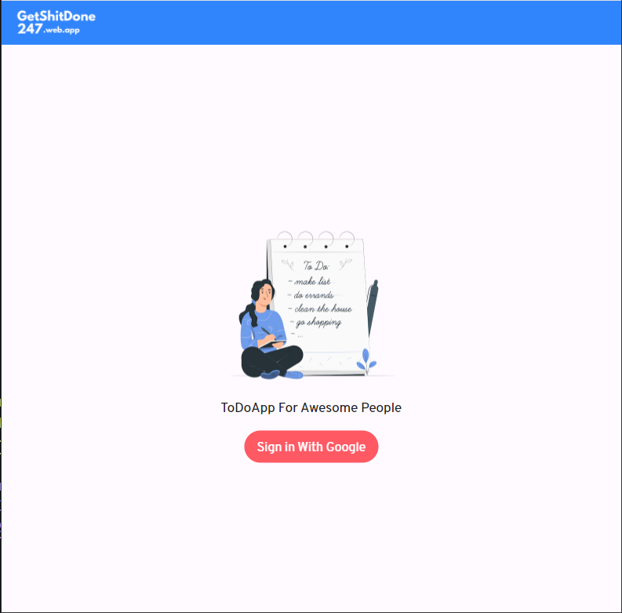
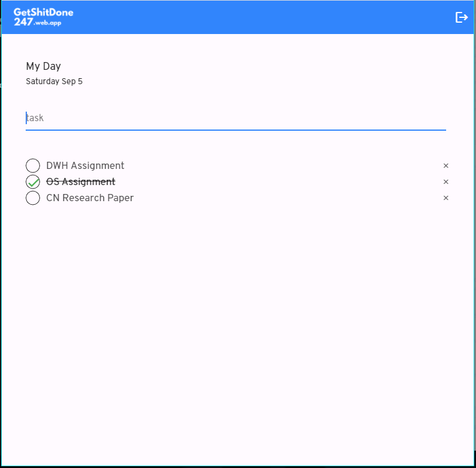

# flutter_todo_web_app

This is a simple ToDo web app developed in flutter

## Screenshots
 

## Found bug
If you found any bug please add that bug in issue section. so that our team will solve bug as soon as possible.

## How you can contribute
This extension is open source anyone can contribute. We are always ready for new ideas and new functionalities so pull request are always welcome

This project is a starting point for a Flutter application.

A few resources to get you started if this is your first Flutter project:

- [Lab: Write your first Flutter app](https://flutter.dev/docs/get-started/codelab)
- [Cookbook: Useful Flutter samples](https://flutter.dev/docs/cookbook)

For help getting started with Flutter, view our
[online documentation](https://flutter.dev/docs), which offers tutorials,
samples, guidance on mobile development, and a full API reference.
